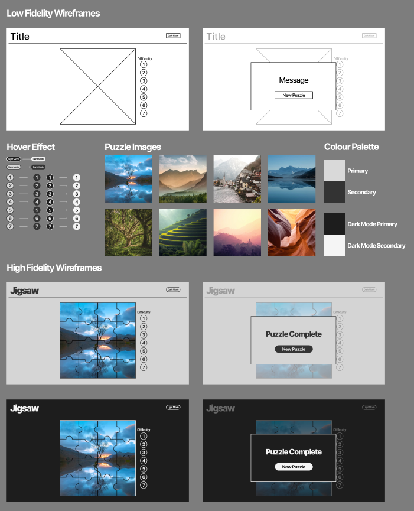

# SoftwareDevelopmentAssignment1-JigSaw
## Context
### 1.1 Project Introduction
    This project is a jigsaw puzzle website that was made in html, css and javascript. The jigsaw puzzle consists of multiple dragable pieces that lock into place when placed in the correct location to make a bigger image. There are eight total images that can be used for the puzzle with the infrastructure in place to support future additions to the image pool. The website also contains 7 total difficulties that can be manually selected or automatically ascended through as puzzle are ccompleted. The user is also provided the option of dark mode to reduce eye strain in low light environments.

### 1.2 Group Contributers 
    I am the sole contributer for this project 

### 1.3 Design and Functional Breakdown 
    

### 1.4 Target User Profiles

### 1.5 User Requirements

### 1.6 
### 1.7 Design Mockups
### 1.8 Storyboards
### 1.9 Risk Assessment
### 1.10 Development Strategy
### 1.11 Test Plan

## 2.0
### 2.1 Spec Improvement 
### 