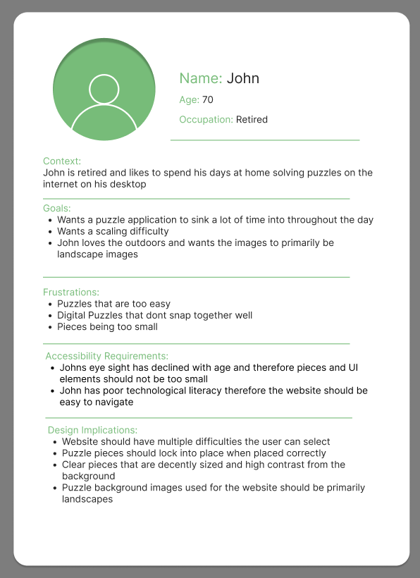

# Software Development Assignment 1 - Jigsaw Website
 
### 1.1 Project Introduction
This project is a jigsaw puzzle website that was made in html, css and javascript utilising html canvas. The jigsaw puzzle consists of multiple dragable pieces that lock into place when placed in the correct location to make a bigger image. There are eight total images that can be used for the puzzle with the infrastructure in place to support future additions to the image pool. The website also contains 7 total difficulties that can be manually selected or automatically ascended through as puzzle are ccompleted. The user is also provided the option of dark mode to reduce eye strain in low light environments. 

Here is the live site: https://gray593.github.io/SoftwareDevelopmentAssignment1-Jigsaw/

### 1.2 Group Contributers

I am the sole contributer for this project. 

### 1.3 Design and Functional Breakdown 

Above is the design board that was created throughout the projects development 

Above is the flowchart that was created to plan the high level functionality of the project 

Above is the Pseudocode that was created based off of the flowchart to map the high level functionality in more detail

### 1.3.1 Draw Function Breakdown

### 1.3.2 Solved Function Breakdown

### 1.3.3 Main Function Breakdown 

### 1.3.4 Create Function Breakdown

### 1.3.5 Shuffle Function Breakdown 

### 1.3.6 Event Listeners Breakdown 

### 1.3.7 Onclick Function Breakdown 

### 1.4 Target User Profiles

### 1.5 User Requirements
Based on the above user profiles a set of user requirements can be developed as found below.

* The puzzles on the website should vary in difficulty and let the user select the difficulty as both Clare and John have differing needs in this regard
* The website and puzzles should load quickly as Clare is impatient
* The images used for the puzzles should be high quality, visually appeasing and primarily scenic landscapes as both Clare and John emphasised the importance of the quality images used for the puzzle
* The user interface should be responsive and easy to navigate this was emphasised in Clare’s user profile
* Pieces should be reasonably sized and high contrast from the background as John is visually impaired
* Pieces should snap into place as John misses this when completing digital jigsaws and gets frustrated by the lack of feedback
 

### 1.6 System Requirements 
This section contains the system requirements for this project that have been divided into subcategories based on their context:

Hardware Requirements:
* The project will be optimised for computers not for mobile so although it will still function on mobile but there may be some optimisation issues or bugs
* The game is built for modern browsers, it requires JavaScript to be enabled and therefore may not work on older browsers
* The website has been designed for at least 1080p and may be too zoomed in on lower resolutions and too zoomed out on resolutions of a lot larger scale
* An input method that can utilise the mouse pointer is required as the game is designed to be played with the cursor and therefore is unplayable with just a keyboard or game controller

Project Requirements:
* The program must allow users to play a jigsaw puzzle game in the web browser without having to download any resources
* The puzzle will load a random image when the page is loaded and every time a new puzzle is started 
* The user can select a difficulty level that increases the number of puzzle pieces as the difficulty increases
* The program must display a “Puzzle Complete” message when the puzzle is solved
* A “Next Puzzle” button must be displayed to the user after puzzle completion that allows the player to start a new puzzle
* A “Dark Mode” button will toggle between light and dark themes.
* The website will be aesthetically pleasing.

Game rules and mechanical requirements:
* The puzzle will be created by slicing an image into pieces
* The pieces will then be shuffled randomly
* The user can use the cursor to drag pieces around the canvas/puzzle board
* When pieces are approximately in the right position they should snap into place and be locked
* When the puzzle is completed, the program should detect this congratulate the user and prompt them to start a new puzzle
* Multiple difficulty buttons will be available to the user to allow for them to increase the difficulty from the default

### 1.7 System Testing

Above is the full system testing log that was completed at the end of development as can be observed the website passed all test this is due to the iterative development style that enabled the program to continually be improved throughout the development process and detailed system requirements that ensured the project always moved in the correct direction. 

### 1.8 Review of the Development Strategy
During the development of this project, iterative development was utilised to ensure the output was of a sufficient quality and didn’t stray from the needs of the user. Iterative development is the process of repeating steps of the development cycle and building up the software piece by piece and learn from every step (Wikipedia, 2025).
This development strategy was implemented constantly throughout the development process this can be observed in the above flowchart which only displays the games basic higher level functionality this logic was then developed into a minimum viable product (MVP) that at first just displayed an image this was then iterated upon to slice the image into pieces and then was further developed to shuffle the pieces. After this pseudocode was then developed to better map out more complex game features. A more specific example of iterative development that was employed in the development process was the discovery of the drawImage function running before the image was loaded this was iterated upon until it was placed within the userImage.onload event, this ensured the image had loaded before being drawn. The main advantages of iterative development are it allows for continuous improvement, it is very flexable (One Beyond, 2025) and is good for projects of a smaller size like this project (Agile Business Consortium, 2025). Unfortunately like all development strategies iterative development does have some disadvantages one of which is the length of time it takes to deliver the final project (Brown, 2025). The iterative process can be very slow and the amount of time required scales exponentially with project scope. Fortunately, this disadvantage was mitigated by the small scope of this project. Another disadvantage of iterative development is the cost of resources consumed by the project can be quite high due to the repetitive nature of each iteration and the amount of time consumed by this process (ProfessionalQa.com, 2019).  

### 1.9 Evaluation
This section will aim to evaluate the project’s success against system and user requirements and then reason whether the project was a success overall

The website does a great job of meeting the user requirements. The website and the puzzles contained within load near instantly. The images used are high resolution and are visually appealing while contributing to the difficulty of the puzzle. They are also high contrast compared to the background to accommodate visually impaired users. The interface is clear and easy to navigate. The pieces snap into place when in the correct position. For the most part pieces are decently sized but as the difficulty increases the pieces get smaller this could negatively impact some users and partially fails to completely meet the user requirement. In future this could be remedied by increasing the game board size with difficulty rather than shrinking the pieces. Overall, the website has met nearly all of the users requirements therefore meeting the needs outlined by clare and john in their user profiles. 

Furthermore, the website also meets all system requirements. The website runs seamlessly when used within the parameters outlined in the hardware requirements. All project requirements have been met. The website allows the user to complete jigsaw within the web browser. The user can select a difficulty; the number of pieces increase with the difficulty. Once the puzzle is complete the puzzle complete screen is displayed, and the user can load a new puzzle. Dark mode has been successfully implemented allowing for the website to be used comfortably in low light environments. The website has successfully matched the aesthetic outlined in the design in an attempt to be aesthetically pleasing. All game rules and mechanical requirements have been met. The website successfully loads an image, slices it into pieces that are draggable and snap into the correct place. when the puzzle is completed, the user is congratulated and prompted to start a new puzzle. The user is also able to select puzzles of varying difficulties as outlined in the requirements.

Overall, the website is a success when measured by its ability to fulfil the requirements set out prior to its development. In future to improve the project the board would increase in size rather than the pieces decrease when playing on higher difficulties. Leaderboards would be introduced to track who completes the most puzzles and more images would be added to the image pool to increase replayability.

## 2.0 References 
https://www.cambridgeinternational.org/Images/697401-2026-pseudocode-guide-for-teachers.pdf

https://en.wikipedia.org/wiki/Iterative_and_incremental_development

https://one-beyond.com/pros-cons-iterative-software-development/

https://www.agilebusiness.org/dsdm-project-framework/iterative-development.html

https://www.invensislearning.com/blog/agile-vs-iterative-model/

https://www.professionalqa.com/iterative-model